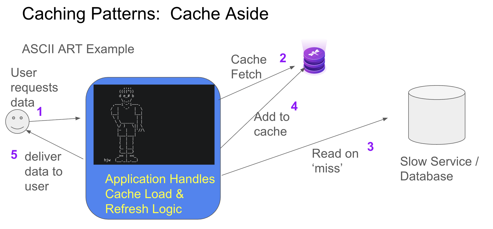

### This is a simple example written in python 
### It showcases using the Redis API and a cache for a remote website that serves ascii art
### This example uses the cache-aside pattern where the application is responsible for populating the cache with data ( the first time any selection is made, the underlying service will be invoked )

This is the most common way to use a shared cache service like Redis or Dragonfly, Valkey, etc. With this strategy, the application first looks into the cache to retrieve the data. If data is not found (cache miss),  the application then retrieves the data from the operational data store directly. Data is loaded to the cache only when necessary (hence: lazy-loading). Read-heavy applications can greatly benefit from implementing a cache-aside approach.




### the user will be presented with a busy printout of many ascii art choices
### each choice will look like this:
<code>['acorn']</code>

### the full list shown looks like this:

<details><summary>Sample Output:</summary>
<p>
```
  ['007'] ['3D'] ['3D_tutorial'] ['aardvark'] ['abacus'] ['abduction'] ['aborigine'] ['abstract'] ['accident'] ['accidental_art'] ['acorn'] ['acropolis'] ['action'] ['advent_calendar98'] ['advent_calendar99'] ['advent_wreath'] ['advise'] ['aerobics'] ['aeroflot'] ['afghanistan'] ['africa'] ['airplane'] ['airport'] ['akbar_jeff'] ['akeru'] ['aladdin'] ['albania'] ['albatross'] ['algeria'] ['alice'] ['alice_cooper'] ['alien'] ['alligator'] ['alt-ascii-art'] ['altar'] ['amazon'] ['ambigram'] ['ambulanc'] ['america'] ['amiga'] ['amnesty'] ['amoeba'] ['amsterdam'] ['anchor'] ['andorra'] ['android'] ['angel'] ['anime'] ['ankh'] ['ankylosaurus'] ['anomalocaris'] ['answering_machine'] ['ant'] ['antarctic'] ['anteater'] ['antelope'] ['antenna'] ['antlers'] ['anubi'] ['anvil'] ['any_key'] ['apocalypse'] ['apollo'] ['applause'] ['apple'] ['arbor'] ['archaeopteryx'] ['archery'] ['ariel'] ['ark_of_noah'] ['armadillo'] ['armchair'] ['army'] ['arrg'] ['arrow'] ['art_gallery'] ['arthritis'] ['artist'] ['artist_gallery'] ['ascii'] ['aspirin'] ['ass'] ['asterix'] ['astronaut'] ['astronomy'] ['atari'] ['atheism'] ['augh'] ['australia'] ['auto'] ['autobahn'] ['autumn'] ['avenge'] ['awake'] ['award'] ['axe'] ['baby'] ['backup'] ['bacon'] ['bacteriophage'] ['badge'] ['badger'] ['badminton'] ['ball'] ['ballerina'] ['ballet'] ['ballista'] ['balloon'] ['ballroom'] ['bambi'] ['banana'] ['band'] ['band_logos'] ['bang'] ['banjo'] ['banner'] ['baphomet'] ['bar'] ['barba'] ['barbed_wire'] ['barber'] ['barf'] ['barmaid'] ['barn'] ['baseball'] ['bash'] ['basket'] ['basketball'] ['bass'] ['bassinet'] ['bassoon'] ['bat'] ['batgirl'] ['bath'] ['bathing'] ['batman'] ['battleship'] ['bauhaus'] ['bavaria'] ['bay'] ['bayliner'] ['beach'] ['beachball'] ['beacon'] ['beagle'] ['bear'] ['beard'] ['bearhug'] ['beast'] ['beatles'] ['beau'] ['beaver'] ['bed'] ['bedpan'] ['bedroom'] ['bee'] ['beehive'] ['beer'] ['beetle'] ['bell'] ['belt'] ['bench'] ['beretta'] ['berlin'] ['bger'] ['bib'] ['bible'] ['bicycle'] ['big_bang'] ['bike'] ['bikini'] ['billard'] ['binary'] ['binoculars'] ['biplane'] ['bird'] ['bird_of_prey'] ['birdcage'] ['birdhouse'] ['birth'] ['birthday'] ['bjork'] ['blabla'] ['black'] ['bleeding_hearts'] ['blender'] ['blind'] ['blondes'] ['blood'] ['blossom'] ['blowfish'] ['bluebells'] ['boa'] ['boar'] ['board_game'] ['boat'] ['body'] ['bodybuilding'] ['boing'] ['bomb'] ['bond'] ['bone'] ['bonsai'] ['books'] ['bookshelf'] ['bookworm'] ['boomerang'] ['boop'] ['boots'] ['booze'] ['border'] ['bored'] ['bosnia'] ['boston'] ['bottle'] ['bottle_opener'] ['bottleship'] ['bottom'] ['bouquet'] ['bow'] ['bowing'] ['bowl'] ['bowling'] ['box'] ['boxer'] ['boxes'] ['boy'] ['bra'] ['brachiopod'] ['brachiosaurus'] ['braille'] ['brain'] ['bravo'] ['brazil'] ['bread'] ['breakfast'] ['breastfeeding'] ['brick_wall'] ['bricklayer'] ['bride+groom'] ['bride'] ['bridge'] ['britain'] ['broom'] ['bruised'] ['bsd'] ['bse'] ['bubble_gum'] ['bucket'] ['budapest'] ['buddha'] ['budgerigar'] ['budweiser'] ['buffalo'] ['bug'] ['buggy'] ['bugsbunny'] ['building'] ['bulb'] ['bull'] ['bulldog'] ['bulldozer'] ['bullet'] ['bulls_eye'] ['bullying'] ['bunch'] ['bungee'] ['bungee_jumping'] ['bunker'] ['bunny'] ['bunsen_burner'] ['burial'] ['bus'] ['bust'] ['butcher'] ['butt'] ['butterfly'] ['buxtehude']
```
</details>

### The user should use the text inside the single quotes to indicate their choice eg: 
<code> acorn </code>

### To run the program you execute:

<code>
python aas.py --host localhost --port 10000 
</code>

### To run the program using TLS you can execute: (note currently this program does not expect CA certs on the client machine)
<code>
python aas.py --host localhost --port 10000 --password mypassowrd --use-tls True --ssl-cert-reqs none
</code>

### ^^ assumes you have redis-py installed

## SETUP

1. initialize the python virtual environment specific to this project:
``` 
python3 -m venv qp_env
``` 

2. activate the python environment:  [This step is repeated anytime you want this qp environment back]

``` 
source qp_env/bin/activate
``` 

3. Install the libraries: [only necesary to do this one time per environment]

```
pip3 install -r requirements.txt
```

# Further Instructions / Options
## You can start the program with no ascii art cached data in Redis by adding an additional argument:

<code>
python aas.py --host localhost --port 10000 --clear True 
</code>


### The first time the program is run you will see results like this:

```
Total time taken in seconds by cache operations: 0.00931716
Total time taken in seconds by non-cache operations: 1.080892801
TOTAL PROGRAM EXECUTION TIME (without user time) == 1.0902099609375

```
### If you run it again: 
[ assuming you do not include the '--clear True' option ]

### The ascii art options will have been cached and you will see results like this 

(assumes you choose a different ASCII ART object):

```
python3 aas.py

Total time taken in seconds by cache operations: 0.006021738
Total time taken in seconds by non-cache operations: 0.30087924
TOTAL PROGRAM EXECUTION TIME (without user time) == 0.3069009780883789
```

### Notice the implementation of the caching of the individual ascii art payloads: 
if you load the same ascii art choice more than once, you will see even faster (fully cached) results:

```
python3 aas.py
Total time taken in seconds by cache operations: 0.0131917
Total time taken in seconds by non-cache operations: 0.002849102
TOTAL PROGRAM EXECUTION TIME (without user time) == 0.016040802001953125
```

# Final Thoughts:

## You should see that using the Cache-aside pattern makes your client experience better 
## The application will also scale much better if you add additional clients -- as they will all share the same cached values.
## The ascii art website will be happier too :) 